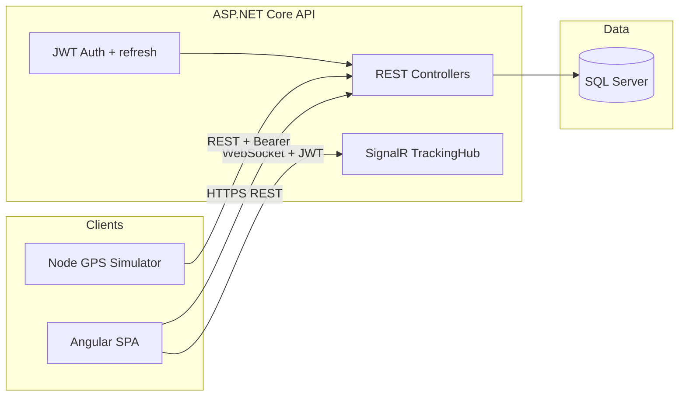

# BusNet — Project Overview (Presentation)

Audience: stakeholders, reviewers, or class demos. High level; adjust numbers and URLs to match your environment.

---

## 1. What is BusNet?

**BusNet** is a small end-to-end fleet operations demo: manage **buses** and **planned routes**, assign routes to buses, and **track live positions** on a map with real-time updates. It includes a **GPS simulator** so you can demo movement without hardware.

---

## 2. Business capabilities (demo script)

| Area | What you can show |
|------|-------------------|
| **Identity** | Login; JWT access + refresh; session persisted in the browser. |
| **Buses** | CRUD-style management, status (Active / Inactive), **assign / unassign route**; list shows **route name** when assigned. |
| **Routes** | Define routes as ordered waypoints; CSV import for bulk points. |
| **Tracking** | Sidebar of **active** buses with **name, route, status**; per-bus “show on map”; **live GPS trail** and **planned route** overlay; Leaflet map with optional Google/OSM tiles. |
| **Realtime** | Server pushes location updates over **SignalR**; map markers and trails update without full page refresh. |

---

## 3. System architecture



**Data flow (tracking):**

1. Operator opens **Tracking** → SPA loads paged **Active** buses (`GET /api/buses` with filters/sort).
2. User checks buses to show on map → SPA may fetch full bus by id and resolves route geometry (`POST /routes/by-ids`).
3. Simulator (or real device) posts locations → API persists and broadcasts via **SignalR** → SPA updates markers and trails.

---

## 4. Technology stack

| Layer | Choices |
|------|---------|
| **Frontend** | Angular **21**, standalone components, Angular Material **21**, NgRx (**store**, **effects**, **devtools**). |
| **Maps** | **Leaflet** + plugins (clusters, decorators, optional Google mutant layer). Keys stay in **`environment`** — do not commit real production keys publicly. |
| **Backend** | **ASP.NET Core**, **Entity Framework Core**, **SQL Server**, **ASP.NET Identity** (core), JWT bearer + refresh endpoint. |
| **Realtime** | **SignalR** hub at `/hubs/tracking`; browser passes access token via query string on WebSocket upgrade. |
| **Simulator** | TypeScript / **Node**, `node-fetch`; Vitest tests; periodic location POST + auth/session recovery on **401**. |
| **Testing** | Backend: **xUnit**. Frontend / simulator: **Vitest** (+ Playwright **e2e** under `frontend/e2e`). |

---

## 5. Repository layout (mental map)

| Path | Role |
|------|------|
| `backend/src/BusNet.Api` | HTTP API, CORS, auth, SignalR map, EF migrations bootstrap. |
| `backend/src/BusNet.Core` | Entities, DTOs, domain contracts. |
| `backend/src/BusNet.Infrastructure` | `DbContext`, `TokenService`, migrations. |
| `backend/tests/BusNet.Tests` | Integration + unit tests. |
| `frontend/src/app` | Feature modules: `auth`, `home`, `shell`, `bus`, `route`, **`tracking`**; interceptors (incl. **single-flight JWT refresh** on 401); SignalR client. |
| `simulator` | Long-running GPS feed for demos. |

---

## 6. Security & auth (talking points)

- **Two JWT kinds**: short-lived **access** (calls API + SignalR) and longer-lived **refresh** (rotation on `POST /api/auth/refresh` only).
- **Default authorize policy** requires claim **`token_kind=access`** so a refresh token cannot be misused as a general API Bearer.
- **CORS**: configured origins in config; Development can allow **browser loopback** origins on any port for `ng serve` convenience.
- **Demo user**: seeded when database is empty (see `Program.cs` `SeedAsync` — credentials are intentionally weak for **local demos only**; change for anything real).

---

## 7. Running a local demo

**Prerequisites:** SQL Server (connection string in `backend/src/BusNet.Api/appsettings.json`), Node + .NET SDK.

1. **API**  
   ```bash
   dotnet run --project backend/src/BusNet.Api/BusNet.Api.csproj
   ```
   Uses `launchSettings.json` URLs (often `http://localhost:5085` — avoid **5000** on macOS if AirPlay listens there).

2. **Frontend**  
   ```bash
   cd frontend && npm install && npm start
   ```
   Point **`src/environments/environment.ts`** **`apiUrl`** / **`hubUrl`** at your API base (`…/api` and `…/hubs`).

3. **Simulator (optional)**  
   ```bash
   cd simulator && npm install && npm start
   ```
   Set **`API_URL`** if the API base is non-default (`http://HOST:PORT/api`).

**Checks:** Login → Bus / Route CRUD → assign route → Tracking → toggle buses on map → start simulator → watch markers/trails update.

---

## 8. Suggested slides (10–15 min)

1. Title — *BusNet: fleet overview & live tracking*.
2. Problem — *Operate buses with planned routes + see where they are now.*
3. Architecture diagram (above).
4. Live demo checklist (§2).
5. Stack table (§4) — one line each.
6. Security one-liner — *JWT access vs refresh + SignalR*.
7. Roadmap / Q&A — *e.g. production hardening, device auth, alerting.*

---

## 9. Disclaimer

This repo is oriented toward **development and presentation**. Rotate secrets, lock down Identity password policy, HTTPS, connection strings, and CORS **before** any production deployment.

---

*Generated for presentation use; refine branding and timelines to match your audience.*
